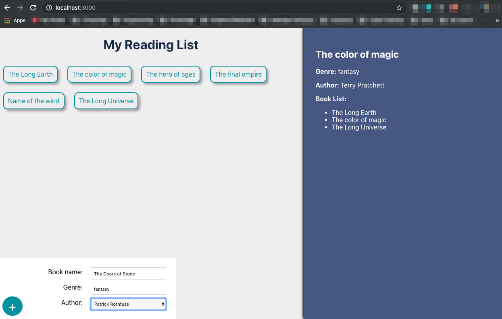
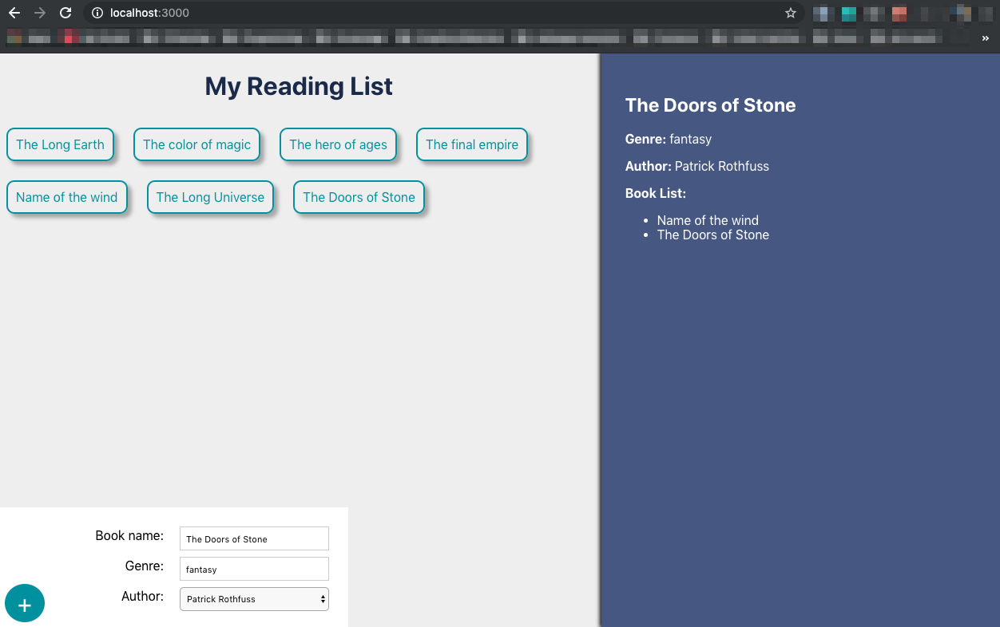
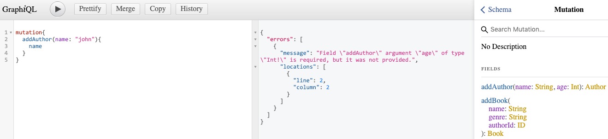

# Book List using Function Components

In this project I am experimenting with function components and using [React Hooks](https://reactjs.org/docs/hooks-intro.html). 

What am I using: 
 * Server - Express app, GraphQL
 * Database - [MongoDB Atlas](https://www.mongodb.com/cloud/atlas)
 * Client - [REACT](https://github.com/facebook/create-react-app), [Apollo](apollographql.com/docs/react/get-started/) (help bind graphql to our REACT app), [GraphiQL](https://github.com/graphql/graphiql) (tool to view schema locally)

## Project workflow
---
I have a page that loads my book list. On the left hand side, it lists the book titles. This data is retreived from the MongoDB Atlas collection.

When you click on the title of any book, on the right hand side you will see more information about this book. Along with the book list of other books the author has written.

On the bottom left hand side, you only have the option to add a new book. Fill in the title, genre and select from the listed authors and click the + button. The book details are written immediately to mongoDB and will be listed above along with the other books.   

## Instructions 
---
Follow these steps:
* Open a terminal or my preference [iTerm](https://iterm2.com/)
* Download the repo, `cd` into the root folder
* Run `npm install` 
* I run `source etc/local.env` first to load my env varibles to be used by server/app.js. *I have a etc/local.env with environment variables used to connect to my MongoDB Atlas collection. This folder was not uploaded due to sensitive info.*  
* Switch to server dir: `cd server/` 
* Run `npm run watch` to get nodemon running. It will startup GraphiQL and also connect to MongoDB Atlas.
* If you want to access graphiQL, you just need to input in your web browser URL: `http://localhost:4000/graphql`
    * Example of what commands to run:
    
* Open new tab on terminal, and navigate to `cd client/` 
* Run `npm start` to get React to start.
* You can now access the React app on `http://localhost:3000`

